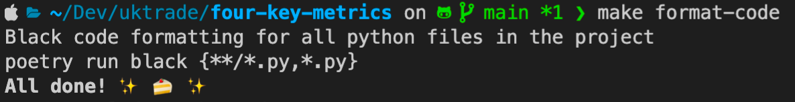
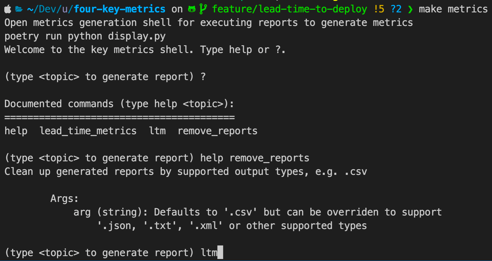

# Four Key Metrics

[](https://circleci.com/gh/uktrade/four-key-metrics/tree/main)

Intended as a way to measure the `four key metrics` as defined in the book Accelerate by Forsgren, Humble and Kim.

- [x] [product delivery] lead time (Time between code committed and code deployed)
- [ ] deployment frequency (Number of deployments of new code per day)
- [ ] mean time to restore (MTTR) (How long does it take to restore the service after it has been impaired?)
- [ ] change fail percentage (% of times the CI/CD pipeline for the default branch fails or causes an outage in any environment)

## Environment

- The _Make_ file contains all the commands for running the application and generating/maintaining specific reports

  - `make format-code` Developers can run black on the code base to format any developer files for any code issues, where possible, and output the file changes within the file

    

  - `make install` Will install all the poetry configured libraries to run this application

  - `make metrics` Will run the application ready for execute a relevent command - see output in terminal for how to use the application

    - Once up and running, help on documented commands can be attained by typing help or ? and extended to help on specific commands by typing the `help <command>`

      

  - `make test` or `make watch-test` Will run tests locally

## Local setup

pre-requisites:

- poetry

`poetry install`

## Testing

`make test`

To automatically watch for changes and rerun tests use `make watch-test`

## Running the tool

In order to run the tool you need to **copy the sample.env** to .env and configure the following environment variables:

```bash
export GITHUB_USERNAME='my-username'
export GITHUB_TOKEN='1234'
export DIT_JENKINS_USER='a-username'
export DIT_JENKINS_TOKEN='5678'
```

`poetry run python display.py`

Note on tests not appearing in vscode
A common reason for this is that you're trying to run tests with dependencies. If this is the case, you can select your interpreter by running ctrl/cmd + shift + p and searching Python: Select Interpreter, then selecting the correct interpreter.

## Data structure

Jenkins returns a list of all builds for a project. The list of builds is checked against GitHub commits to calculate lead times.

## Pingdom API
Pingdom API token is stored in:
https://passman.ci.uktrade.digital/secret/332d1a02-3816-4a9b-a751-135226c043fa/

If required a new Pingdon API token can be generated at:
https://my.pingdom.com/app/api-tokens

Pingdom documentation:
https://docs.pingdom.com/api/


